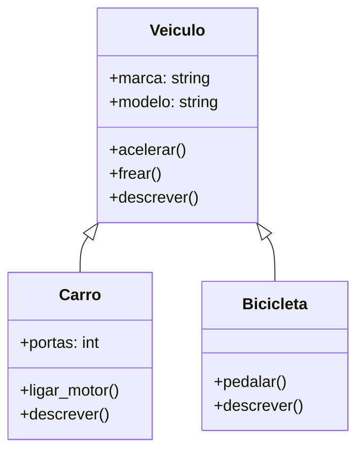

# Desafio 8: Programação Orientada a Objetos

## Modelando o Mundo Real: A Escolha do Domínio de Transportes

A Programação Orientada a Objetos (POO) é, para mim, uma forma de traduzir o mundo real para o código. Em vez de pensar apenas em funções e dados soltos, começamos a pensar em "objetos" que possuem características (atributos) e que podem realizar ações (métodos).

[cite_start]Para este desafio, a proposta era modelar uma hierarquia de classes em um domínio da minha preferência[cite: 28]. Decidi escolher o domínio de **transportes**, pois ele é muito visual e perfeito para ilustrar o conceito de **herança**. A ideia é simples: todo carro é um veículo, e toda bicicleta é um veículo, mas cada um tem suas particularidades.

## A Arquitetura das Classes: Herança e Polimorfismo

Meu objetivo foi criar uma estrutura que fosse simples, mas que demonstrasse claramente os pilares da POO.

1.  **A Classe Base: `Veiculo`**
    Criei uma classe genérica `Veiculo` para servir como nosso "molde" principal. Todo e qualquer veículo no nosso sistema, não importa o tipo, terá as características e ações definidas aqui:
    * **Atributos:** `marca` e `modelo`.
    * **Métodos:** `acelerar()` e `frear()`.

2.  **As Classes Derivadas: `Carro` e `Bicicleta`**
    Aqui a **herança** entra em ação. Tanto `Carro` quanto `Bicicleta` "herdam" tudo da classe `Veiculo`, mas adicionam seus próprios toques especiais:
    * `Carro`: Além de marca e modelo, tem um atributo `portas` e um método exclusivo, `ligar_motor()`.
    * `Bicicleta`: Não tem motor, mas tem um método próprio: `pedalar()`.

3.  **O Polimorfismo em Ação com o método `descrever()`**
    Para demonstrar o **polimorfismo**, criei um método `descrever()` na classe `Veiculo`. A palavra significa "muitas formas", e é exatamente isso que o método faz. Tanto `Carro` quanto `Bicicleta` implementam sua própria versão desse método. Assim, quando chamamos `meu_carro.descrever()`, a resposta é diferente de quando chamamos `minha_bike.descrever()`, mesmo que o nome do método seja o mesmo.

## O Diagrama da Hierarquia

Para visualizar essa estrutura, modelei um diagrama de classes simples. Ele mostra claramente a relação de "é um" (um Carro **é um** Veículo) definida pela herança.



## Código-Fonte do Modelo

[cite_start]A implementação completa deste modelo, usando Python[cite: 56], está no arquivo `transporte.py`. Ele contém todas as classes e um pequeno bloco de teste para demonstrar a criação dos objetos e a chamada dos seus métodos.

Para executar e ver o modelo em funcionamento:
```bash
python transporte.py
```